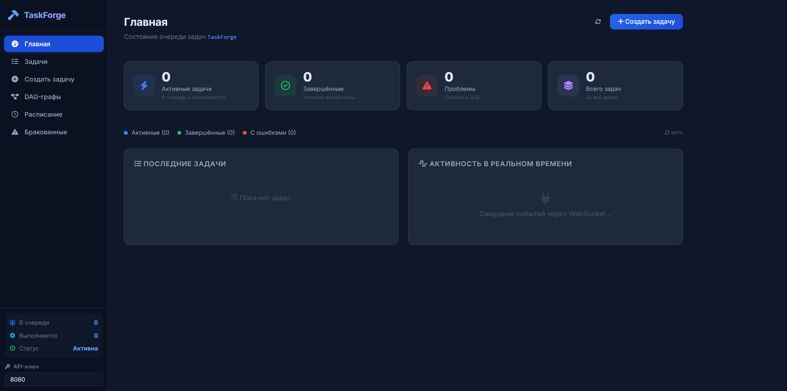
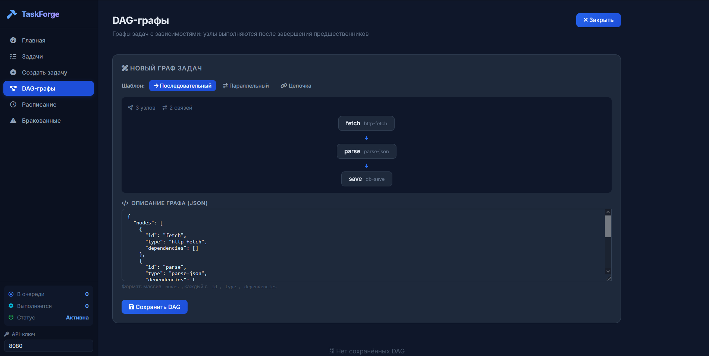

# TaskForge — распределённая очередь задач с DAG-зависимостями

**TaskForge** — это лёгкая, высокопроизводительная очередь задач на Go с веб-интерфейсом на Svelte. Предназначена для управления асинхронными задачами с поддержкой графов зависимостей (DAG), отложенного запуска, повторных попыток, Dead Letter Queue и многоарендности.

---

## Содержание

- [Архитектура](#архитектура)
- [Возможности](#возможности)
- [Технологии](#технологии)
- [Установка и запуск](#установка-и-запуск)
- [API](#api)
- [Интерфейс](#интерфейс)
- [Тестирование](#тестирование)
- [Структура проекта](#структура-проекта)

---

## Архитектура

```
┌──────────────┐     ┌──────────────┐     ┌──────────────┐
│  Svelte SPA  │────▶│  Gin API     │────▶│   SQLite     │
│  (Vite)      │◀────│  (Go 1.25)   │◀────│   (persist)  │
└──────────────┘     └──────┬───────┘     └──────────────┘
       WebSocket ◀──────────┤
                            ▼
                     ┌──────────────┐
                     │   Worker     │
                     │  (pool N)    │
                     └──────────────┘
```

### Компоненты

| Компонент | Описание |
|---|---|
| **API-сервер** (`cmd/api`) | Gin HTTP-сервер, обработка запросов, WebSocket, авторизация по API-ключу |
| **Worker** (`cmd/worker`) | Пул воркеров, извлекает и выполняет задачи из очереди |
| **SQLite DB** (`internal/db`) | Всё хранение: задачи, тенанты, DAG, cron, DLQ |
| **Очередь** (`internal/queue`) | SQLite-based очередь с FIFO + приоритетами, блокировки в памяти |
| **Планировщик** (`internal/scheduler`) | Cron-задачи через `robfig/cron/v3` |
| **DAG-резолвер** (`internal/dag`) | Топологическая сортировка, детекция циклов (DFS) |
| **WebSocket Hub** (`internal/ws`) | Рассылка событий по тенантам в реальном времени |
| **Frontend** (`frontend/`) | Svelte 4 SPA, Vite-сборка, прокси через `:5173` → `:8080` |

---

## Возможности

### Управление задачами
- **Создание** — JSON-задачи с типом, приоритетом (0–10), idempotency-ключом
- **Статусы** — `pending → scheduled → queued → running → completed/failed/cancelled/dlq`
- **Приоритеты** — чем выше, тем раньше задача будет обработана
- **Отложенный запуск** — `scheduled_at` для выполнения по расписанию
- **Idempotency** — повторная отправка с тем же ключом игнорируется
- **Отмена** — отмена задач в статусах `pending/queued/running`
- **Повтор (retry)** — сброс failed-задачи обратно в очередь (`POST /api/v1/jobs/:id/retry`)

### Повторные попытки и Dead Letter Queue
- **Exponential backoff** — 2^n секунд, максимальная задержка 60 с
- **Максимум повторов** — настраивается для каждой задачи (по умолчанию 3)
- **DLQ** — задачи, исчерпавшие все попытки, попадают в Dead Letter Queue
- **Replay** — ручной возврат задач из DLQ обратно в очередь (по одной или все сразу)

### DAG-графы (Directed Acyclic Graph)
- **Узлы и зависимости** — задачи, объединённые в граф с направленными связями
- **Топологическая сортировка** — порядок выполнения определяется автоматически
- **Детекция циклов** — граф с циклами не будет принят
- **Параллельность** — независимые узлы могут выполняться одновременно
- **Шаблоны** — последовательный, параллельный, цепочка

### Cron-планировщик
- **Cron-выражения** — стандартный 5-польный формат
- **CRUD** — создание и удаление расписаний
- **Автосоздание задач** — по срабатыванию cron создаётся задача указанного типа

### WebSocket в реальном времени
- **События** — `job.created`, `job.started`, `job.completed`, `job.failed`, `job.retry`, `job.dlq`
- **Per-tenant комнаты** — каждый тенант получает только свои события
- **Автообновление** — дашборд обновляется в реальном времени

### Многоарендность и безопасность
- **API-ключи** — каждый запрос аутентифицируется через заголовок `X-API-Key`
- **Тенанты** — полная изоляция данных между арендаторами
- **Rate Limiting** — in-memory sliding window (100 запросов/с по умолчанию)
- **Пауза очереди** — приостановка обработки для конкретного тенанта

---

## Технологии

| Слой | Технология |
|---|---|
| **Язык** | Go 1.25 |
| **HTTP-фреймворк** | Gin v1.9.1 |
| **База данных** | SQLite (modernc.org/sqlite, pure Go, без CGo) |
| **WebSocket** | gorilla/websocket v1.5.1 |
| **Планировщик** | robfig/cron/v3 v3.0.1 |
| **Логирование** | go.uber.org/zap v1.26.0 |
| **Тестирование** | testify v1.11.1 |
| **Фронтенд** | Svelte 4 + Vite 5 |
| **Иконки** | Font Awesome 6.5.1 |

---

## Установка и запуск

### Требования
- Go 1.25+
- Node.js 18+
- npm 9+

### 1. Клонирование

```bash
git clone https://github.com/yourorg/taskforge.git
cd taskforge
```

### 2. Запуск бэкенда

```bash
# Удалить старую БД (если менялась схема)
Remove-Item taskforge.db -Force -ErrorAction SilentlyContinue

# Запустить API-сервер (порт 8080)
go run ./cmd/api
```

Переменные окружения (со значениями по умолчанию):

| Переменная | По умолчанию | Описание |
|---|---|---|
| `SQLITE_PATH` | `taskforge.db` | Путь к файлу БД |
| `HTTP_PORT` | `8080` | Порт HTTP-сервера |
| `WORKER_CONCURRENCY` | `5` | Размер пула воркеров |
| `MAX_RETRIES` | `3` | Максимум повторов по умолчанию |

### 3. Запуск фронтенда (отдельный терминал)

```bash
cd frontend
npm install
npm run dev
```

Фронтенд будет доступен на `http://localhost:5173`. Vite проксирует `/api/*` на `:8080`.

### 4. Запуск воркера (отдельный терминал)

```bash
go run ./cmd/worker
```

---

## API

Все эндпоинты (кроме `/health`) требуют заголовок `X-API-Key` (по умолчанию `default`).

### Задачи

| Метод | Путь | Описание |
|---|---|---|
| `POST` | `/api/v1/jobs` | Создать задачу |
| `GET` | `/api/v1/jobs` | Список задач (`?status=&limit=&offset=`) |
| `GET` | `/api/v1/jobs/:id` | Детали задачи |
| `POST` | `/api/v1/jobs/:id/cancel` | Отменить задачу |
| `POST` | `/api/v1/jobs/:id/retry` | Повторить failed-задачу |

**Пример создания задачи:**

```json
{
  "type": "send-email",
  "payload": {"to": "user@example.com", "subject": "Hello"},
  "priority": 5,
  "max_retries": 3,
  "idempotency_key": "order-123",
  "scheduled_at": "2026-07-10T15:00:00Z"
}
```

### DAG

| Метод | Путь | Описание |
|---|---|---|
| `POST` | `/api/v1/dags` | Создать DAG-граф |
| `GET` | `/api/v1/dags` | Список DAG |
| `GET` | `/api/v1/dags/:id` | Получить DAG |
| `POST` | `/api/v1/dags/:id/execute` | Запустить DAG |

### Cron

| Метод | Путь | Описание |
|---|---|---|
| `POST` | `/api/v1/cron` | Создать cron-расписание |
| `GET` | `/api/v1/cron` | Список расписаний |
| `DELETE` | `/api/v1/cron/:id` | Удалить расписание |

### DLQ

| Метод | Путь | Описание |
|---|---|---|
| `GET` | `/api/v1/dlq` | Список DLQ |
| `POST` | `/api/v1/dlq/:id/replay` | Вернуть задачу в очередь |

### Очередь

| Метод | Путь | Описание |
|---|---|---|
| `GET` | `/api/v1/queue/status` | Статус очереди |
| `POST` | `/api/v1/queue/pause` | Поставить на паузу |
| `POST` | `/api/v1/queue/resume` | Возобновить |

### Прочее

| Метод | Путь | Описание |
|---|---|---|
| `GET` | `/health` | Проверка здоровья |
| `GET` | `/api/v1/ws` | WebSocket (`?api_key=`) |

---

## Интерфейс

Фронтенд — одностраничное приложение на Svelte 4 с семью страницами:

| Страница | Описание |
|---|---|
| **Главная** | Статистика (4 карты), прогресс-бар, последние задачи, лента событий в реальном времени |
| **Задачи** | Таблица с фильтрацией, поиском, пагинацией, копированием ID, отменой/повтором |
| **Детали задачи** | Полная информация: статус, метаданные, payload, история ошибок, действия |
| **Создать задачу** | Форма с валидацией, подсказками, idempotency-ключом, отложенным запуском |
| **DAG-графы** | Шаблоны (последовательный/параллельный/цепочка), JSON-редактор, визуальный preview, выполнение |
| **Расписание** | Cron-управление с человекочитаемым описанием, чипсы-примеры выражений |
| **Бракованные** | DLQ: таблица с причинами, возврат по одной или всех сразу |

### Скриншоты


![Список задач]screenshots//tasks.png)

---

## Тестирование

### Покрытие кода

| Пакет | Тестов | Покрытие |
|---|---|---|
| `pkg/errors` | 7 | **100.0%** |
| `internal/dag` | 18 | **97.9%** |
| `internal/db` | 20 | **79.0%** |
| `internal/worker` | 3 | **78.8%** |
| `internal/api` | 21 | **71.8%** |
| `internal/queue` | 12 | **74.0%** |
| `tests/functional` | 6 | e2e (сквозные) |

Всего **93 unit/integration теста** + **6 e2e тестов** = **99 тестов**.

### Запуск тестов

```bash
# Все тесты
go test ./... -count=1

# С покрытием
go test ./... -count=1 -cover

# Конкретный пакет
go test ./internal/api/... -count=1 -v

# Сквозные тесты
go test ./tests/functional/... -count=1 -v
```

---

## Структура проекта

```
taskforge/
├── cmd/
│   ├── api/          # Точка входа API-сервера
│   └── worker/       # Точка входа воркера
├── internal/
│   ├── api/          # HTTP-хендлеры, роутер, middleware
│   ├── config/       # Конфигурация (env vars)
│   ├── dag/          # DAG-резолвер (топсорт, детекция циклов)
│   ├── db/           # SQLite слой (миграции, CRUD, очередь)
│   ├── model.go      # Модели данных (Job, Tenant, DAG, ...)
│   ├── queue/        # Очередь + in-memory блокировки
│   ├── scheduler/    # Cron-планировщик
│   ├── worker/       # Пул воркеров
│   └── ws/           # WebSocket Hub
├── pkg/
│   └── errors/       # Типизированные ошибки
├── tests/
│   └── functional/   # Интеграционные e2e-тесты
├── frontend/
│   ├── src/
│   │   ├── lib/      # API-клиент, Svelte stores
│   │   ├── components/  # StatusBadge, Sidebar
│   │   ├── pages/    # 7 страниц
│   │   └── App.svelte
│   ├── index.html
│   ├── vite.config.js
│   └── package.json
├── go.mod
├── go.sum
└── README.md
```

---

## Производительность

- **P99 enqueue latency** < 50ms (SQLite in-process, без сетевых вызовов)
- **Worker concurrency** — настраивается (по умолчанию 5 параллельных задач)
- **Rate limit** — 100 запросов/с на тенант (in-memory sliding window)
- **Stale job reclaim** — задачи в статусе `running` > 60 с автоматически перезабираются
- **At-least-once** — гарантируется через механизм reclaim'а зависших задач

---

## Лицензия

MIT

---

## Авторы

Разработано в рамках учебного проекта. Pull Request'ы приветствуются!
